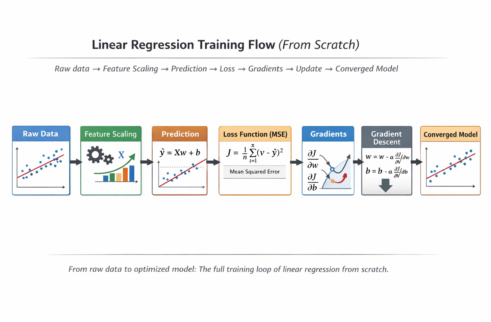

# Linear Regression from Scratch




Simple, from-scratch implementation of univariate linear regression using batch gradient descent, plus a minimal training script and evaluation metrics.

## Project Structure
- `train.py`: end-to-end example (load CSV, split, scale, train, evaluate)
- `src/linear_regression.py`: linear regression implementation
- `src/preprocessing.py`: standard scaler
- `src/metrics.py`: MSE, RMSE, MAE, R2
- `src/utils.py`: train/test split helper
- `data/sample.csv`: sample dataset

## Requirements
- Python 3.9+
- `numpy`

Install dependencies:
```bash
pip install -r requirements.txt
```

## Data Format
`data/sample.csv` should include headers `x` and `y`:
```csv
x,y
1.0,2.0
2.0,3.5
```

## Run Training
```bash
python train.py
```

The script prints learned parameters and metrics on both the train and test splits.

## Math Overview
We model a single feature `x` with a linear function:
```
y_hat = w * x + b
```

We minimize mean squared error (MSE):
```
J(w, b) = (1/n) * sum((y_hat - y)^2)
```

Batch gradient descent updates parameters using the full dataset each epoch:
```
dJ/dw = (2/n) * sum((y_hat - y) * x)
dJ/db = (2/n) * sum(y_hat - y)
```
```
w = w - lr * dJ/dw
b = b - lr * dJ/db
```

## Code Walkthrough
- `src/linear_regression.py` converts inputs to 2D, initializes `w` and `b`, then loops over epochs to compute predictions, loss, gradients, and parameter updates.
- `src/preprocessing.py` standardizes features to zero mean and unit variance to help gradient descent converge.
- `src/utils.py` provides a simple `train_test_split` with optional shuffling and a fixed seed.
- `src/metrics.py` implements common regression metrics used by `train.py`.
- `train.py` wires everything together: read CSV, split, scale, fit, predict, and print metrics.

## Notes
- This is a minimal educational implementation intended for clarity over performance.
